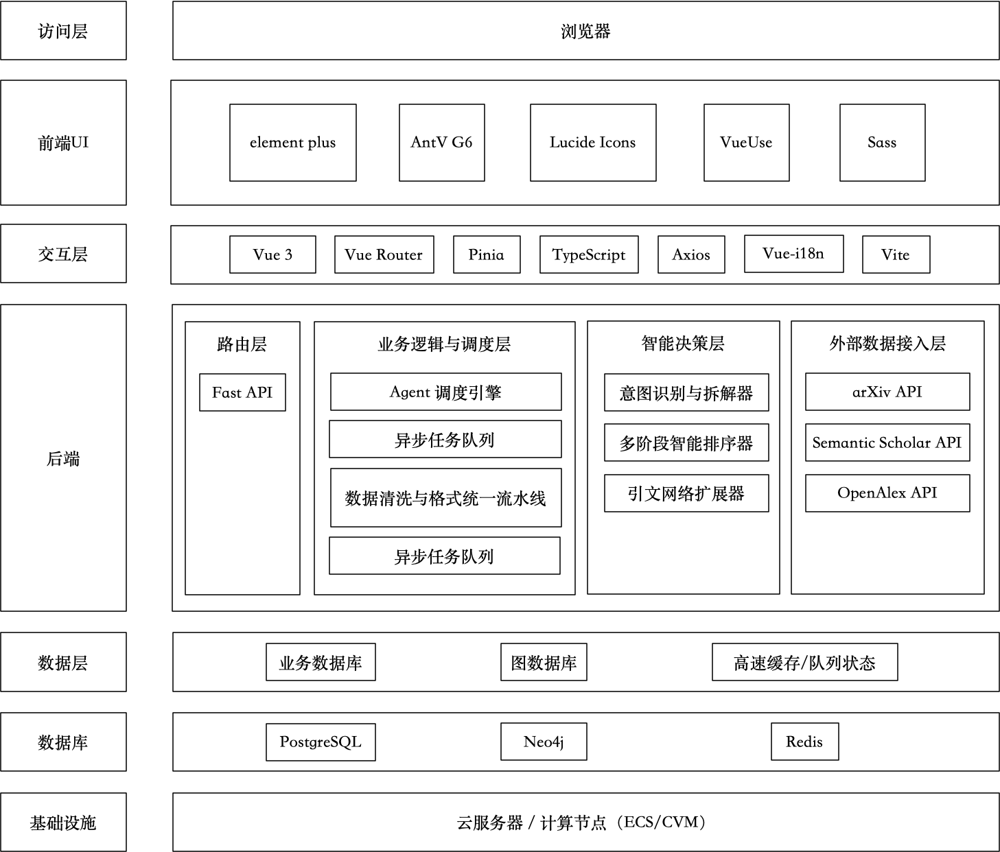

# ESASR：证据状态驱动的自适应学术检索框架

**Evidence-State Adaptive Scholarly Retrieval (ESASR)**

> 面向复杂学术查询的智能论文搜索与推荐系统  
> Intelligent Academic Paper Search and Recommendation System for Complex Research Queries

## 使用 npm 从 GitHub 安装

前置条件：Node.js 20.11 或更高版本，以及正在运行的 Docker Desktop / Docker
Engine。项目不要求用户预先安装 Python、PostgreSQL、Redis 或 Neo4j。

仓库发布到 GitHub 后，可以直接从 GitHub 地址全局安装 CLI：

```bash
npm install -g git+https://github.com/wanglei1123/ESASR.git
esasr init ESASR
cd ESASR
esasr start
```

`esasr init` 会启动交互式配置向导：

1. 使用 ↑/↓ 选择 DeepSeek、Qwen、OpenAI、Kimi 或自定义兼容平台，按空格确认；
2. 隐藏输入 API Key；
3. 可选配置 Semantic Scholar 和 OpenAlex；
4. 自动生成本地 `.env`、`config.yaml` 和随机 JWT 密钥；
5. API Key 仅保存在本机 `.env`，不会进入前端构建或 Git。

初始化和启动时会展示“第八届中国研究生人工智能创新大赛企业赛题 科研场景下复杂学术查询的智能论文搜索与推荐演示项目”标识；交互式终端启动前会先清屏，并播放红蓝扫光标题动画。

随时可以重新配置或检查环境：

```bash
esasr setup
esasr config
esasr doctor
esasr status
esasr logs api web
esasr stop
```

### 常用终端命令

| 命令 | 作用 |
| --- | --- |
| `esasr start` / `esasr up` | 启动服务 |
| `esasr stop` / `esasr down` | 终止服务 |
| `esasr restart --no-build` | 不重新构建镜像并重启服务 |
| `esasr status` | 查看容器运行状态 |
| `esasr logs api web` | 查看 API 和 Web 日志 |
| `esasr config` | 安全显示当前配置，不输出 Key 内容 |
| `esasr agent list` | 查看各平台 API Key 配置状态 |
| `esasr agent add deepseek` | 添加 DeepSeek API Key |
| `esasr agent update deepseek` | 修改 DeepSeek API Key |
| `esasr agent set openai` | 添加或覆盖 OpenAI API Key |
| `esasr agent remove openai` | 删除 OpenAI API Key（会确认） |
| `esasr academic list` | 查看 Semantic Scholar 与 OpenAlex Key 状态 |
| `esasr academic add semantic-scholar` | 添加 Semantic Scholar API Key |
| `esasr academic set openalex` | 添加或覆盖 OpenAlex API Key 与联系邮箱 |
| `esasr academic remove openalex --yes` | 删除 OpenAlex API Key 与联系邮箱 |
| `esasr provider list` | 列出平台、Key 状态和默认平台 |
| `esasr provider current` | 查看当前默认平台 |
| `esasr provider use qwen` | 将 Qwen 设为默认平台 |

支持的 Agent 平台名称为 `deepseek`、`qwen`、`openai`、`kimi` 和 `custom`；学术搜索数据源名称为 `semantic-scholar`（可简写为 `s2`）和 `openalex`。两类 API Key 均使用隐藏输入并仅写入当前项目的 `.env`。

推荐配置顺序：

```bash
esasr agent set deepseek
esasr provider use deepseek
esasr academic set semantic-scholar
esasr academic set openalex
esasr config
esasr restart --no-build
```

`esasr config` 只显示是否已配置，不显示任何 Key 内容。修改 Key 或默认平台后，需要重启服务使配置生效。

在 macOS 上，如果执行 `esasr start` 时 Docker Desktop 尚未运行，CLI
会询问是否自动启动它，并等待 Docker daemon 就绪后继续部署。

启动时终端会显示 Codex 风格的 `ESASR` 品牌卡片与动态扫光状态。若 8080、8000、5432、6379、7474
或 7687 已被其他程序占用，CLI 会自动寻找相邻空闲端口、保存到 `.env`，再继续
启动，避免 Docker 因 `port is already allocated` 中断。

也可以不全局安装，直接运行 GitHub 包：

```bash
npm exec --yes \
  --package=git+https://github.com/wanglei1123/ESASR.git \
  -- esasr init ESASR
```

## 项目简介

证据状态驱动的自适应学术检索框架（Evidence-State Adaptive Scholarly Retrieval, ESASR）面向科研场景，旨在解决传统关键词检索在复杂科研问题下召回不足、语义理解有限以及结果组织能力弱的问题。

系统基于大语言模型（LLM）构建多阶段 Academic Search Agent，能够自动完成：

- 查询理解与意图解析
- 查询分解与扩展
- 多源学术搜索
- 引文网络扩展
- 智能论文排序
- 搜索结果归纳总结
- 论文推荐与知识发现

用户仅需输入自然语言描述的研究问题，即可获得高质量论文推荐及结构化研究分析结果。

---

## Docker 快速启动

需要 Docker Desktop 或 Docker Engine，并支持 `docker compose`。

```bash
./run.sh
```

首次运行会自动：

1. 从 `.env.example` 创建本地 `.env`；
2. 构建 Vue/Nginx 与 FastAPI 镜像；
3. 启动 PostgreSQL、Redis、Neo4j、API 和 Web；
4. 等待健康检查通过并打印访问地址。

默认地址：

- Web：`http://127.0.0.1:8080`
- API 文档：`http://127.0.0.1:8000/docs`
- Neo4j Browser：`http://127.0.0.1:7474`

建议首次启动前在 `.env` 中填写 LLM 和学术 API 密钥。没有 LLM 密钥时项目
仍可启动；前端会提供“本地规则 · heuristic”，规划不产生远端 Token 消耗。

使用 Kimi 时，在 `.env` 中填写：

```dotenv
LLM_ACTIVE_PROVIDER=kimi
KIMI_API_KEY=你的_Moonshot_API_Key
```

修改后重新运行 `./run.sh --no-build`，Docker 会将密钥安全地传给后端；
密钥不会打包进前端代码。

常用命令：

```bash
./scripts/status.sh                 # 查看状态
./scripts/logs.sh api web           # 查看指定服务日志
./scripts/stop.sh                   # 停止并保留数据
./scripts/stop.sh --volumes         # 停止并删除所有本地数据
./run.sh --no-build                 # 不重新构建镜像
./run.sh --pull                     # 拉取最新基础镜像后启动
./run.sh --with-reranker            # 构建并启用 Cross Encoder
```

端口、密码、模型和 API 密钥均可通过 `.env` 修改。Cross Encoder 模式会安装
额外的 PyTorch/Transformers 依赖，并在首次检索时下载模型，因此首次启动明显
更慢、镜像也更大。

---

## 系统架构



---

## 核心功能

### 查询理解

自动识别：

- 研究主题
- 方法约束
- 数据集约束
- 时间范围
- 发表 Venue
- 开源代码要求

示例：

输入：

```text
近三年多模态大模型在医学影像诊断中的应用，
要求公开代码和顶会论文
```

解析结果：

```json
{
  "topic": "Multimodal LLM",
  "domain": "Medical Imaging",
  "year": "2022-2025",
  "open_source": true,
  "venue": "Top Conference"
}
```

---

### 查询分解

复杂问题自动拆解为多个子查询：

```text
Multimodal Medical LLM

Medical Vision Language Model

Medical Diagnosis Foundation Model
```

---

### 多源检索

支持：

- OpenAlex
- Semantic Scholar
- arXiv

复杂检索统一通过 `POST /api/search/run` 执行。接口会将查询规划产生的
子查询真正用于 OpenAlex 与 Semantic Scholar 的并行召回，并在调用预算内完成：

```text
结构化查询规划
      ↓
多子查询 × 多数据源召回
      ↓
DOI / 规范化标题去重
      ↓
RRF + 约束匹配 + 查询覆盖度融合排序
      ↓
结果证据、检索轨迹与成本指标
```

默认预算为最多 4 个子查询、8 次数据源调用，每个数据源每次返回 15 条候选。
调用方可以在请求中下调预算，以控制 API 消耗与端到端延迟。

首轮检索后，系统会对主题、方法、数据集、领域、Venue 和开放获取约束逐项
计算覆盖度。只有存在覆盖缺口或候选数量不足时，才会生成针对性查询并执行
第二轮检索；第二轮仍受同一 API 调用预算限制。

---

### 引文网络扩展

通过：

- References
- Citations
- Co-Citations

发现潜在高价值论文。

---

### 智能排序

采用多阶段排序策略：

```text
BM25 Recall
      ↓
Embedding Retrieval
      ↓
Cross Encoder Rerank
      ↓
LLM Relevance Judge
```

当前实现支持可选的本地 Cross Encoder。默认关闭以避免首次启动时自动下载
大模型；启用方式：

```bash
cd esasr-api
./venv/bin/pip install -r requirements-reranker.txt
```

然后在 `config.yaml` 中设置：

```yaml
ranking:
  cross_encoder:
    enabled: true
    model: cross-encoder/ms-marco-MiniLM-L6-v2
    top_n: 20
    threshold: 0.0
    adaptive_selector:
      enabled: true
      max_k: 2
      min_score: 0.60
      min_ratio: 0.85
      max_drop: 0.10
```

模型不可用或推理失败时，系统会自动回退到 RRF 融合排序，并在接口的
`metrics.reranker` 和检索轨迹中记录原因。

自适应选择器只读取已经生成的精排分数：默认保留第一名，只有第二名同时满足
绝对置信度、相对第一名置信度与相邻分差三个条件时才扩展为两篇，因此不会新增
API、LLM 或 Cross Encoder 调用。阈值来自冻结开发集，不能在测试集上重新调整。

### 可复现实验与离线评测

Gold 与预测文件均采用 JSONL 格式。论文优先使用 DOI 匹配，其次使用
OpenAlex/Semantic Scholar ID 和规范化标题；Gold 可增加分级相关性、约束及
学科/语言/难度标签，预测可携带 Token、API 调用、延时、轨迹和关系图：

```json
{"id":"q1","query":"检索问题","domain":"medicine","constraints":{"year_from":2022},"relevant":[{"doi":"10.xxxx/xxx","relevance":2}]}
{"id":"q1","constraints":{"year_from":2022},"predicted":[{"doi":"10.xxxx/xxx","title":"Paper title"}],"metrics":{"apiCalls":4,"llmTokens":180,"totalDurationMs":1250}}
```

执行评测：

```bash
cd esasr-api
./venv/bin/python tools/evaluate_retrieval.py \
  --gold evaluation/sample_gold.jsonl \
  --predictions evaluation/sample_predictions.jsonl \
  --k 5 --k 10 --k 20 \
  --bootstrap-samples 5000 \
  --out evaluation/report.json
```

报告包含 Macro/Micro Precision、Recall、F1，MAP、MRR、nDCG，bootstrap
置信区间，约束槽位 F1，结构化字段/证据覆盖率，以及 API/HTTP/Token/延时的
均值、P95 和单位真阳性成本。

比较 A-E 等预算消融：

```bash
cd esasr-api
./venv/bin/python tools/compare_experiments.py \
  --gold evaluation/gold_test.jsonl \
  --run A=evaluation/predictions_A.jsonl \
  --run D=evaluation/predictions_D.jsonl \
  --run E=evaluation/predictions_E.jsonl \
  --out-json evaluation/experiments.json \
  --out-csv evaluation/leaderboard.csv \
  --out-md evaluation/leaderboard.md
```

完整的 Gold Set 构建、指标解释、等预算消融与结果报告规范见
[实验与评测协议](docs/EVALUATION.md)。

---

### 结构化结果输出

输出内容包括：

- 推荐论文列表
- 推荐理由
- 研究热点分析
- 技术路线总结
- 引文关系图谱

---

## 技术栈

### Frontend

- Vue3
- TypeScript
- Vite
- Pinia
- Vue Router
- Element Plus
- ECharts
- AntV G6

### Backend

- Python
- FastAPI

### LLM

- Qwen
- DeepSeek
- OpenAI GPT

### Retrieval

- OpenAlex API
- Semantic Scholar API
- arXiv API

### Ranking

- BM25
- BGE-M3
- BGE-Reranker-v2

### Database

- PostgreSQL
- Redis

### Graph

- NetworkX
- Neo4j（Optional）

---

## 项目结构

```text
ESASR/                    # 项目根目录，与 GitHub 仓库同名

├── esasr-web/      # Vue3 Frontend
├── esasr-api/         # FastAPI Backend
└── README.md
```

---


## 创新点

项目的主线不是堆叠 LLM、向量库和知识图谱，而是把复杂学术检索改造成一个
**由证据状态驱动的预算决策过程**：

1. **约束编译**：把主题、方法、数据集、年份、Venue、开放获取等自然语言要求转成可执行计划，降低查询分解时的语义漂移。
2. **证据缺口路由**：首轮后逐项诊断约束覆盖，只在确有缺口且预算允许时生成补检查询；每次扩展均记录原因、调用量和覆盖变化。
3. **置信度校准自适应结果集（CARS）**：不固定返回 K 篇，而是依据精排分数分布在 Top-1/Top-2 间选择，抑制“为召回而无差别加结果”造成的误报。
4. **可审计输出**：推荐理由绑定命中词项、子查询和来源；关系图区分真实引用与算法相关，降级与失败不被隐藏。

在冻结 V3 候选的 100 条独立测试查询上，固定 Top-1/2/3/5 的 Macro F1 分别为
0.2475/0.1986/0.1665/0.1304；CARS 为 0.2571，平均返回 1.07 篇。相对 Top-1 的
配对差值为 0.0097，95% CI [0.0000, 0.0267]，因此当前只主张初步正向趋势，
不宣称统计显著，也不把该结果外推为在线补检已经有效。

---

## 应用场景

- 文献调研
- 开题报告准备
- Related Work 搜集
- 研究热点分析
- 研究方向发现
- 学术知识探索

---

## 可信运行边界

- 在线主链路使用 OpenAlex 与 Semantic Scholar；任一来源失败会写入运行轨迹，离线演示记录不会进入完整检索的计分候选池。
- 单独调用兼容搜索接口时允许回退到内置演示记录，但记录会明确标注 `Offline Demo`、`offline=true` 和 `offline_fallback`，不会伪装成在线结果。
- 缺失年份、摘要或 DOI 保持缺失并通过 `metadataMissing` 暴露，不使用固定年份或相关度补值。
- 关系图区分有方向的 `CITES` 与无方向的 `RELATED`；OpenAlex `related_works` 不再解释为被引关系。
- `/health` 会逐项检查 PostgreSQL、Redis 与 Neo4j；依赖异常时返回 HTTP 503 和 `overall=degraded`。
- BibTeX/Markdown 导出优先使用 DOI，其次使用来源提供的 URL，不为 Semantic Scholar 或离线记录拼接 OpenAlex 地址。

验证命令：

```bash
cd esasr-api && ./venv/bin/python -m unittest discover -s tests -v  # 48 项
cd ../esasr-web && npm run build
cd .. && npm test && npm run pack:check
```

---

## 团队信息

第八届中国研究生人工智能创新大赛

企业赛题：

科研场景下复杂学术查询的智能论文搜索与推荐

项目团队：Justifying

Justifying © 2026
```
